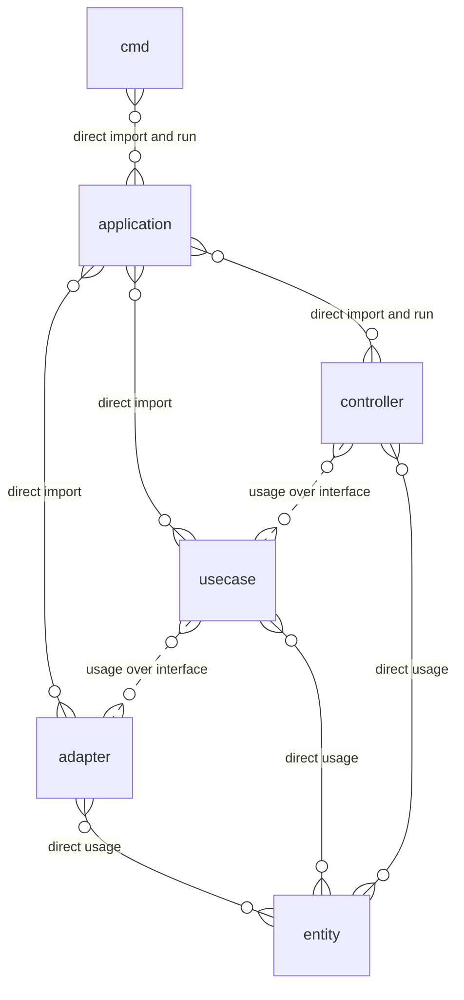
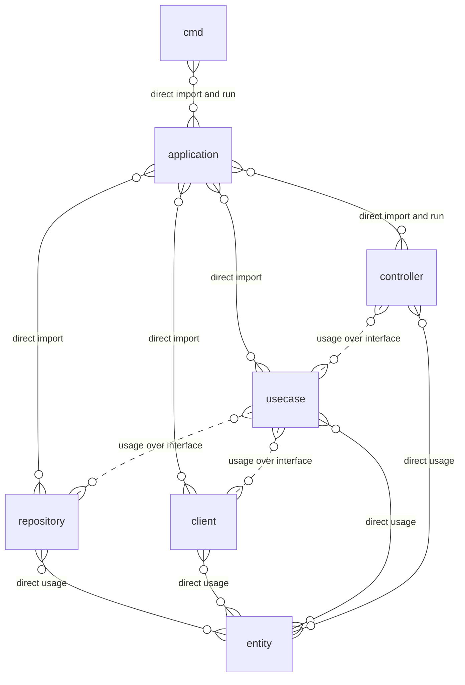
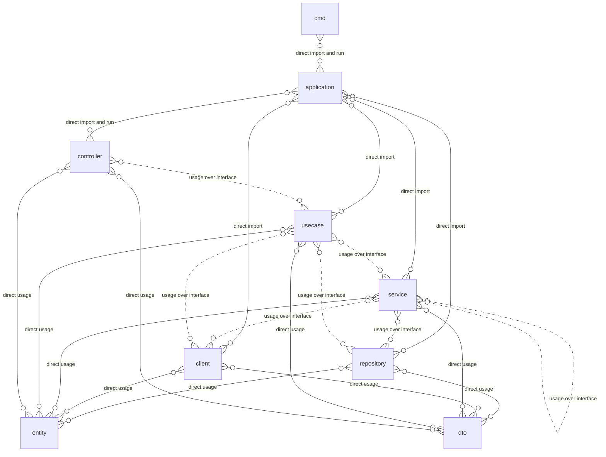

# Линтер для архитектуры проекта и ее визуализатор

Установка

```shell
go install github.com/gbh007/goarchlint/cmd/goarchlint@latest
```

Генерация файла конфигурации, поддерживаются [пресеты линтера](#пресеты-генерации-конфигурации-для-линтера) через `--linter [PRESET_NAME]`

```shell
goarchlint config
```

Генерация документации в локальной директории

```shell
goarchlint generate
```

Валидация в локальной директории, поддерживается флаг для сокрытия сообщений уровня lax - `--silent-lax`

```shell
goarchlint run
```

Генерация документации вне локальной директории

```shell
goarchlint generate -p ~/projects/hgraber/hgraber-next -o ~/projects/hgraber/hgraber-next/docs/arch
```

## Настройка линтера

Настройка путей позволяет использовать маски вида:

- `*` - буквы, цифры и т.п. без `/`, эквивалентно одной части пути
- `**` - любой символ, эквивалентно путям произвольной длины

Настройка линтера производится через правила вида

```toml
[[linter.rules]]
path = "/some/*" # Путь для применения правила, например пакет с контроллерами
deny = ["/other/**"] # Список запрещенных путей, приоритетны над разрешенными
allow = ["/valid", "/logic*"] # Список разрешенных путей, если не указан то без ограничений
type = "strict" # Режим проверки: strict - значимые нарушения, выход с кодом 1; lax - некритичные нарушения
only_inner = true # Применять правило только для импортов внутренних пакетов
description = "some can't use other" # Описание для отображения при нарушении правила
```

Пример конфигурации для use case

```toml
[[linter.rules]]
# Только для пакетов в юзкейсах
path = "/internal/usecases/**"
# Нельзя импортировать пакеты адаптеров, других юзкейсов, контроллеров
deny = ["/internal/adapters/**", "/internal/usecases/**", "/internal/controllers/**"]
# При нарушении завершатся с ошибкой
type = "strict"
# Применять только для внутрених пакетов
only_inner = true
# Добавить это сообщение в информацию
description = "use cases can't depend on other use case, adapter, controller"

[[linter.rules]]
# Только для пакетов в юзкейсах
path = "/internal/usecases/**"
# Разрешить только 1 пакет для импорта
allow = ["/internal/entities"]
# При нарушении только информировать
type = "lax"
# Применять только для внутрених пакетов
only_inner = true
# Добавить это сообщение в информацию
description = "use cases can depend on domain only"
```

## Пресеты генерации конфигурации для линтера

### `hex`

Для простых проектов со следующей структурой

- `cmd/*` - команды для запуска приложения (не более чем инициализация контекста и логера), вызывают инициализацию в applications
- `internal/applications/*` - инициализация приложений: парсинг конфигурации, создание объектов контроллеров и т.п.
- `internal/adapters/*` - адаптеры для хранения данных и обращения ко внешним системам, например: kafka producer, http client, database
- `internal/entities` - бизнес сущности, типы и чистые функции
- `internal/usecases/*` - пакеты с бизнес логикой
- `internal/controllers/*` - пакеты контроллеров, например: kafka consumer, http server, cron



### `hexlite`

Для простых проектов со следующей структурой

- `cmd/*` - команды для запуска приложения (не более чем инициализация контекста и логера), вызывают инициализацию в applications
- `internal/applications/*` - инициализация приложений: парсинг конфигурации, создание объектов контроллеров и т.п.
- `internal/repositories/*` - адаптеры для работы с базами или иными хранилищами данных, например: postgres, redis, s3
- `internal/clients/*` - клиенты для обращения ко внешним системам, например: kafka producer, http client
- `internal/entities` - бизнес сущности, типы и чистые функции
- `internal/usecases/*` - пакеты с бизнес логикой
- `internal/controllers/*` - пакеты контроллеров, например: kafka consumer, http server, cron



### `clean`

Для сложных проектов со следующей структурой

- `cmd/*` - команды для запуска приложения (не более чем инициализация контекста и логера), вызывают инициализацию в applications
- `internal/applications/*` - инициализация приложений: парсинг конфигурации, создание объектов контроллеров и т.п.
- `internal/repositories/*` - адаптеры для работы с базами или иными хранилищами данных, например: postgres, redis, s3
- `internal/clients/*` - клиенты для обращения ко внешним системам, например: kafka producer, http client
- `internal/entities/*` - бизнес сущности, типы и чистые функции
- `internal/dto/*` - структуры для обмена данными между слоями
- `internal/services/*` - пакеты со смешанной логикой (бизнесовая и/или техническая) или логикой что должна переиспользоваться
- `internal/usecases/*` - пакеты с бизнес логикой
- `internal/controllers/*` - пакеты контроллеров, например: kafka consumer, http server, cron


