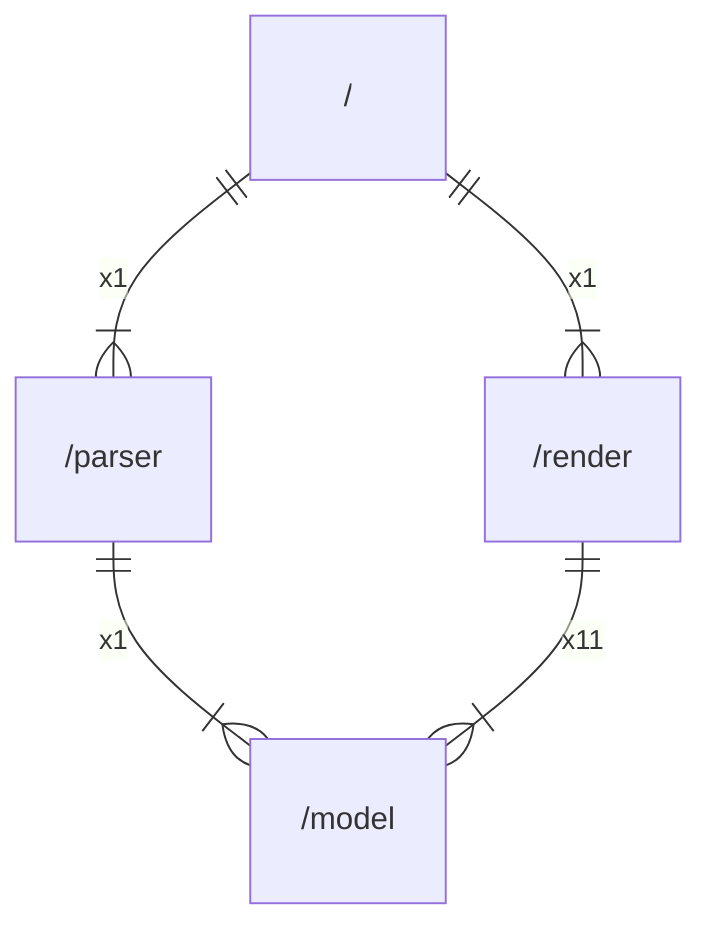

# github.com/gbh007/goarchlint

## Main packages

|    Name    |     Path     |
|:----------:|:------------:|
| goarchlint | [/](main.md) |

## Inner packages

|    Name    |         Path         |
|:----------:|:--------------------:|
| goarchlint |     [/](main.md)     |
|   model    |  [/model](model.md)  |
|   parser   | [/parser](parser.md) |
|   render   | [/render](render.md) |

## External imports

|    Name     |                    Path                    | Count |
|:-----------:|:------------------------------------------:|:-----:|
|     fmt     |                    fmt                     |  13   |
|     io      |                     io                     |   9   |
|    path     |                    path                    |   8   |
|     os      |                     os                     |   7   |
|   slices    |                   slices                   |   5   |
|   strings   |                  strings                   |   4   |
|   errors    |                   errors                   |   3   |
|  filepath   |               path/filepath                |   3   |
| tablewriter |     github.com/olekukonko/tablewriter      |   2   |
|  renderer   | github.com/olekukonko/tablewriter/renderer |   2   |
|     tw      |    github.com/olekukonko/tablewriter/tw    |   2   |
|     fs      |                   io/fs                    |   2   |
|    json     |               encoding/json                |   1   |
|    flag     |                    flag                    |   1   |
|   parser    |                 go/parser                  |   1   |
|    token    |                  go/token                  |   1   |
|   modfile   |          golang.org/x/mod/modfile          |   1   |
|  packages   |       golang.org/x/tools/go/packages       |   1   |

## Scheme

---

> Generated by [goArchLint](https://github.com/gbh007/goarchlint)
