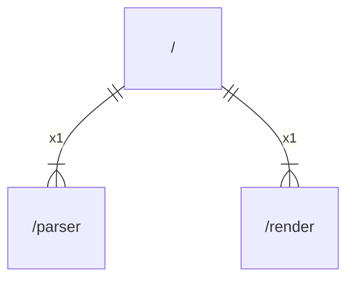

# main

## Imports

|  Name  |         Path         | Inner | Count |
|:------:|:--------------------:|:-----:|:-----:|
|  flag  |         flag         |  ❌   |   1   |
| parser | [/parser](parser.md) |  ✅   |   1   |
| render | [/render](render.md) |  ✅   |   1   |

## Scheme

---

> Generated by [goArchLint](https://github.com/gbh007/goarchlint)
