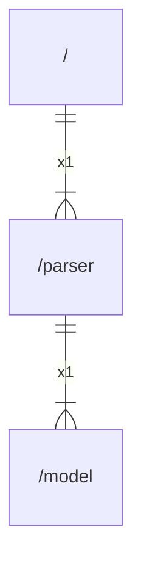

# parser

## Imports

|   Name   |              Path              | Inner | Count |
|:--------:|:------------------------------:|:-----:|:-----:|
|   fmt    |              fmt               |  ❌   |   1   |
|  model   |       [/model](model.md)       |  ✅   |   1   |
|  parser  |           go/parser            |  ❌   |   1   |
|  token   |            go/token            |  ❌   |   1   |
| modfile  |    golang.org/x/mod/modfile    |  ❌   |   1   |
| packages | golang.org/x/tools/go/packages |  ❌   |   1   |
|    io    |               io               |  ❌   |   1   |
|    fs    |             io/fs              |  ❌   |   1   |
|    os    |               os               |  ❌   |   1   |
|   path   |              path              |  ❌   |   1   |
| filepath |         path/filepath          |  ❌   |   1   |
|  slices  |             slices             |  ❌   |   1   |
| strings  |            strings             |  ❌   |   1   |

## Used by

|    Name    |     Path     |
|:----------:|:------------:|
| goarchlint | [/](main.md) |

## Scheme

---

> Generated by [goArchLint](https://github.com/gbh007/goarchlint)
