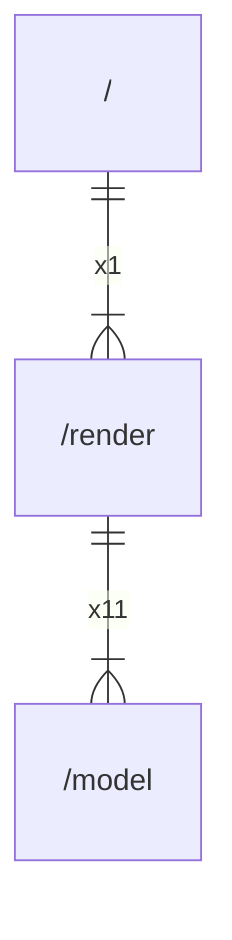

# render

## Imports

|    Name     |                    Path                    | Inner | Count |
|:-----------:|:------------------------------------------:|:-----:|:-----:|
|     fmt     |                    fmt                     |  ❌   |  12   |
|    model    |             [/model](model.md)             |  ✅   |  11   |
|     io      |                     io                     |  ❌   |   8   |
|    path     |                    path                    |  ❌   |   7   |
|     os      |                     os                     |  ❌   |   6   |
|   errors    |                   errors                   |  ❌   |   3   |
|   slices    |                   slices                   |  ❌   |   3   |
|   strings   |                  strings                   |  ❌   |   3   |
| tablewriter |     github.com/olekukonko/tablewriter      |  ❌   |   2   |
|  renderer   | github.com/olekukonko/tablewriter/renderer |  ❌   |   2   |
|     tw      |    github.com/olekukonko/tablewriter/tw    |  ❌   |   2   |
|  filepath   |               path/filepath                |  ❌   |   2   |
|    json     |               encoding/json                |  ❌   |   1   |
|     fs      |                   io/fs                    |  ❌   |   1   |

## Used by

|    Name    |     Path     |
|:----------:|:------------:|
| goarchlint | [/](main.md) |

## Scheme

---

> Generated by [goArchLint](https://github.com/gbh007/goarchlint)
