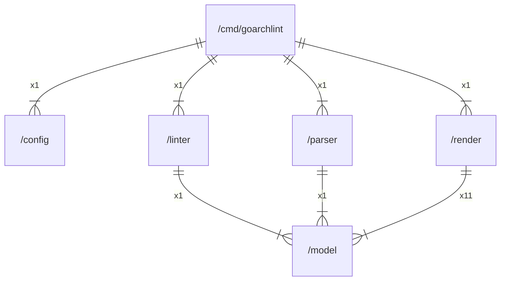

# github.com/gbh007/goarchlint

## Main packages

|    Name    |                 Path                 |
|:----------:|:------------------------------------:|
| goarchlint | [/cmd/goarchlint](cmd/goarchlint.md) |

## Inner packages

|    Name    |                 Path                 |
|:----------:|:------------------------------------:|
| goarchlint | [/cmd/goarchlint](cmd/goarchlint.md) |
|   config   |         [/config](config.md)         |
|   linter   |         [/linter](linter.md)         |
|   model    |          [/model](model.md)          |
|   parser   |         [/parser](parser.md)         |
|   render   |         [/render](render.md)         |

## External imports

|    Name     |                    Path                    | Count |
|:-----------:|:------------------------------------------:|:-----:|
|     fmt     |                    fmt                     |  15   |
|     io      |                     io                     |  10   |
|     os      |                     os                     |   8   |
|    path     |                    path                    |   8   |
|   slices    |                   slices                   |   7   |
|   strings   |                  strings                   |   7   |
|   errors    |                   errors                   |   3   |
|     lo      |            github.com/samber/lo            |   3   |
|  filepath   |               path/filepath                |   3   |
| tablewriter |     github.com/olekukonko/tablewriter      |   2   |
|  renderer   | github.com/olekukonko/tablewriter/renderer |   2   |
|     tw      |    github.com/olekukonko/tablewriter/tw    |   2   |
|     fs      |                   io/fs                    |   2   |
|    json     |               encoding/json                |   1   |
|    cobra    |           github.com/spf13/cobra           |   1   |
|    viper    |           github.com/spf13/viper           |   1   |
|   parser    |                 go/parser                  |   1   |
|    token    |                  go/token                  |   1   |
|   modfile   |          golang.org/x/mod/modfile          |   1   |
|  packages   |       golang.org/x/tools/go/packages       |   1   |
|   regexp    |                   regexp                   |   1   |
|    debug    |               runtime/debug                |   1   |
|   strconv   |                  strconv                   |   1   |

## Scheme

---

> Generated by [goArchLint](https://github.com/gbh007/goarchlint)
