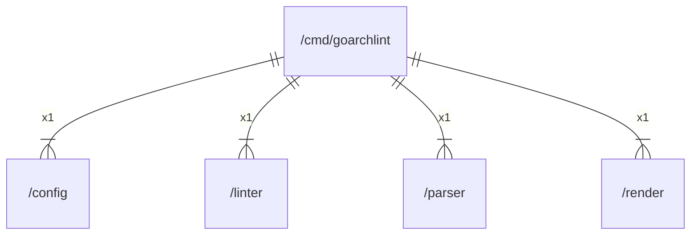

# main

## Imports

|  Name  |          Path           | Inner | Count |
|:------:|:-----------------------:|:-----:|:-----:|
| errors |         errors          |  ❌   |   1   |
|  fmt   |           fmt           |  ❌   |   1   |
| config | [/config](../config.md) |  ✅   |   1   |
| linter | [/linter](../linter.md) |  ✅   |   1   |
| parser | [/parser](../parser.md) |  ✅   |   1   |
| render | [/render](../render.md) |  ✅   |   1   |
|   lo   |  github.com/samber/lo   |  ❌   |   1   |
| cobra  | github.com/spf13/cobra  |  ❌   |   1   |
| viper  | github.com/spf13/viper  |  ❌   |   1   |
|   os   |           os            |  ❌   |   1   |

## Scheme

---

> Generated by [goArchLint](https://github.com/gbh007/goarchlint)
