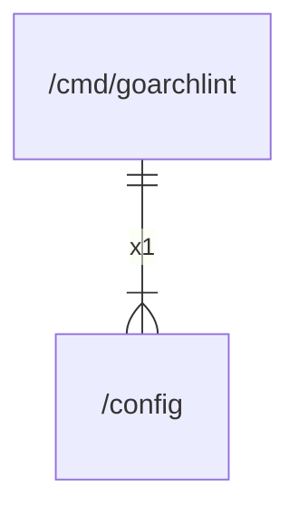

# config

## Imports

| Name  |         Path         | Inner | Count |
|:-----:|:--------------------:|:-----:|:-----:|
|  lo   | github.com/samber/lo |  ❌   |   1   |
| debug |    runtime/debug     |  ❌   |   1   |

## Used by

|    Name    |                 Path                 |
|:----------:|:------------------------------------:|
| goarchlint | [/cmd/goarchlint](cmd/goarchlint.md) |

## Scheme

---

> Generated by [goArchLint](https://github.com/gbh007/goarchlint)
