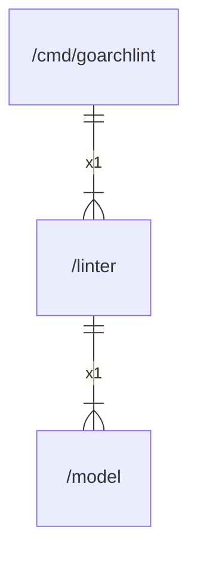

# linter

## Imports

|  Name   |         Path         | Inner | Count |
|:-------:|:--------------------:|:-----:|:-----:|
|   fmt   |         fmt          |  ❌   |   1   |
|  model  |  [/model](model.md)  |  ✅   |   1   |
|   lo    | github.com/samber/lo |  ❌   |   1   |
|   io    |          io          |  ❌   |   1   |
| regexp  |        regexp        |  ❌   |   1   |
| strconv |       strconv        |  ❌   |   1   |
| strings |       strings        |  ❌   |   1   |

## Used by

|    Name    |                 Path                 |
|:----------:|:------------------------------------:|
| goarchlint | [/cmd/goarchlint](cmd/goarchlint.md) |

## Scheme

---

> Generated by [goArchLint](https://github.com/gbh007/goarchlint)
