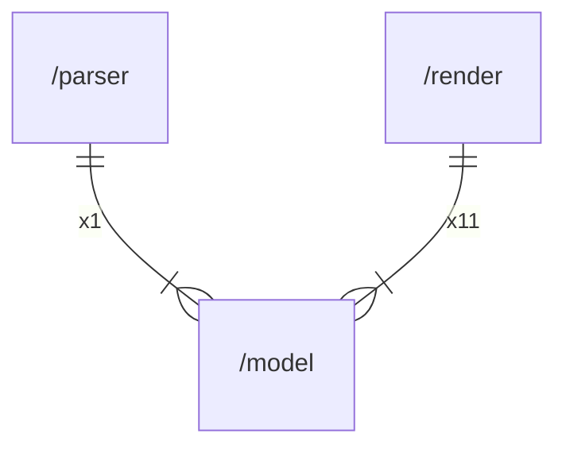

# model

## Imports

|  Name  |  Path  | Inner | Count |
|:------:|:------:|:-----:|:-----:|
| slices | slices |  ❌   |   1   |

## Used by

|  Name  |         Path         |
|:------:|:--------------------:|
| parser | [/parser](parser.md) |
| render | [/render](render.md) |

## Scheme

---

> Generated by [goArchLint](https://github.com/gbh007/goarchlint)
